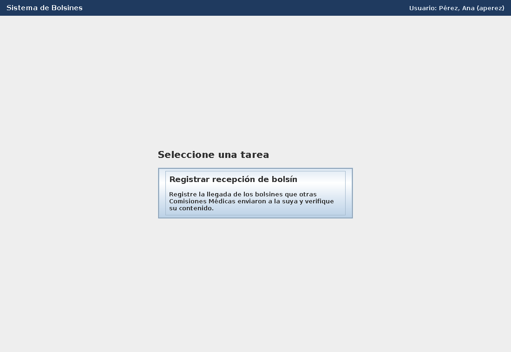
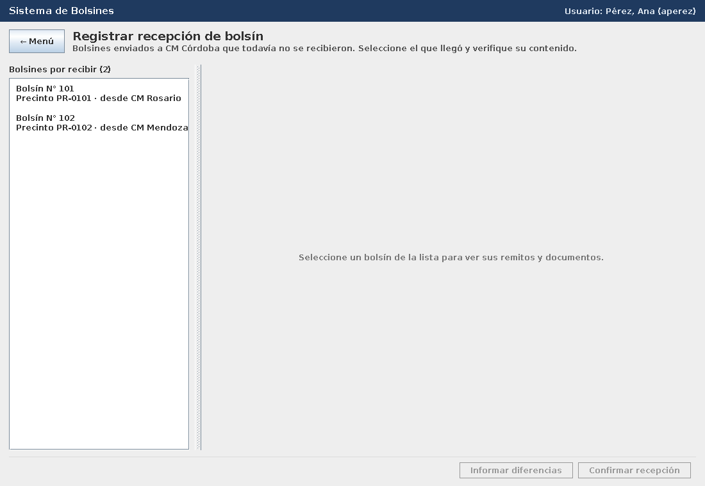
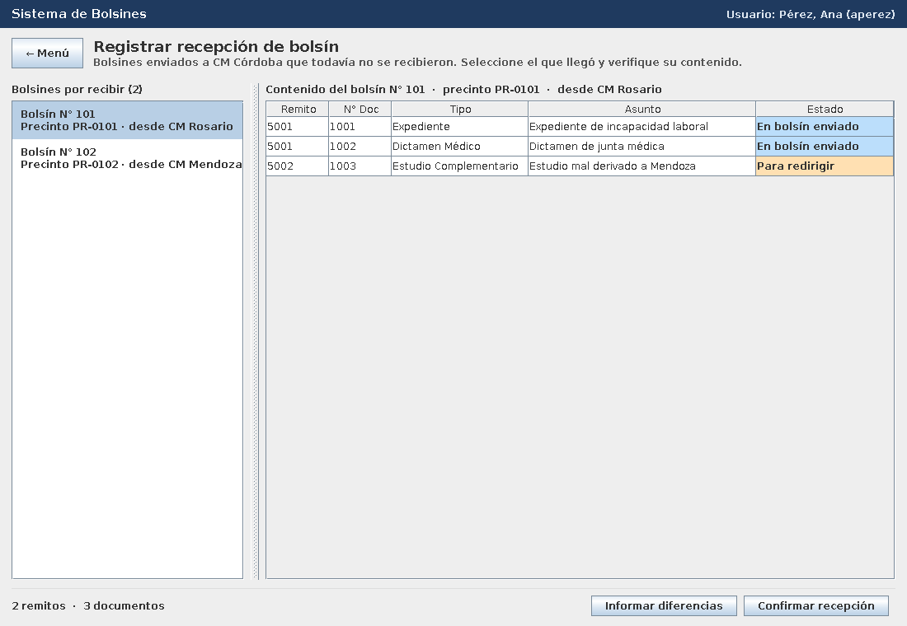
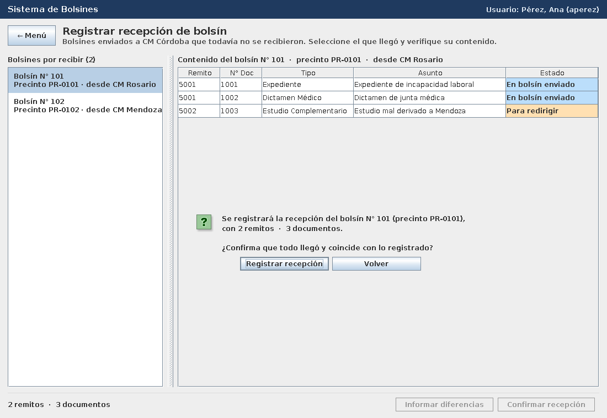
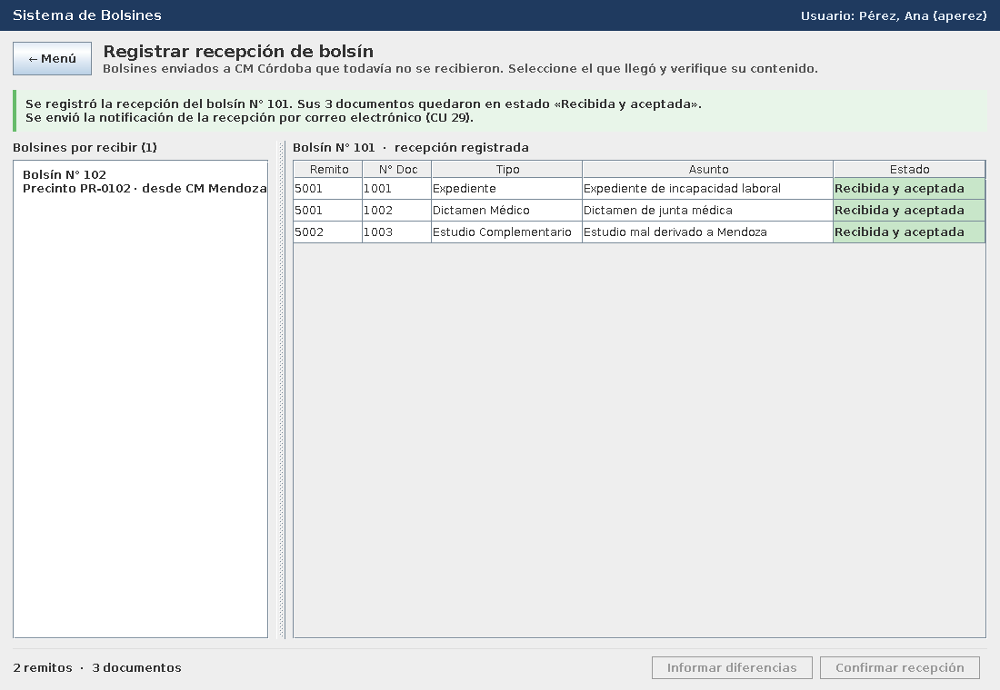
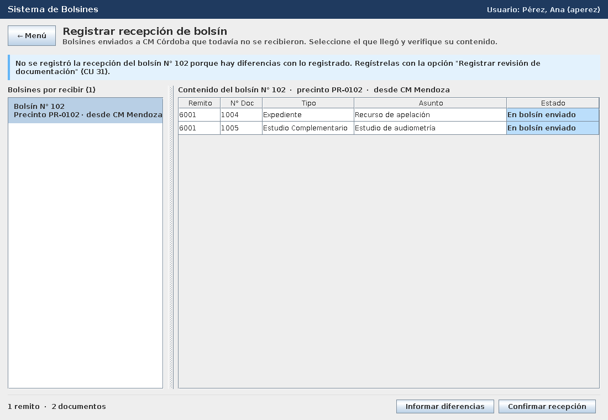
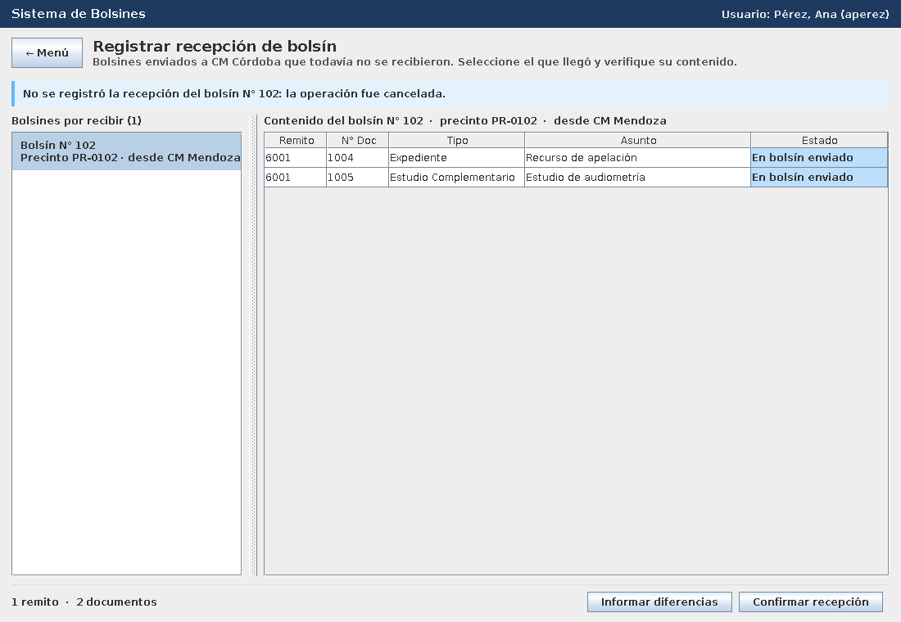
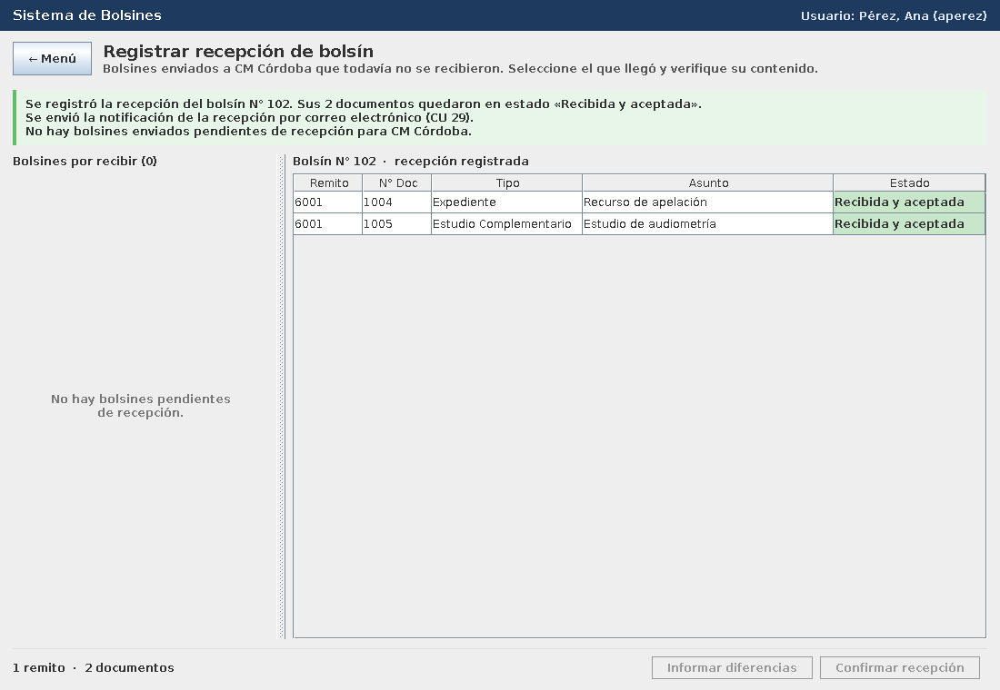
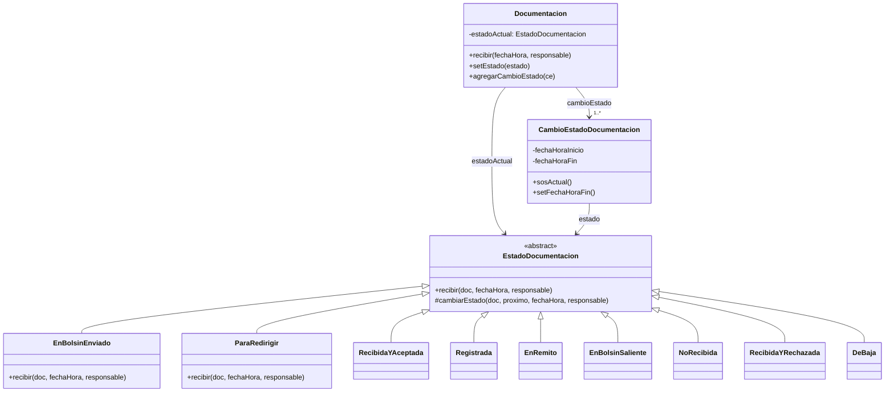

# PPAI 2026 – 3K2 – Grupo 10 – Entrega 2: CU 28 "Registrar Recepción de Bolsín"

Rediseño e implementación de la realización del caso de uso de análisis
`PPAI2026_3K2_G10_E1_Analisis`, aplicando el **patrón de diseño State (Gamma)** a la clase
`Documentacion`, bajo el **Paradigma Orientado a Objetos**.

> ### ▶ ¿Querés ejecutarlo? Seguí la guía paso a paso: **[COMO_EJECUTAR.md](COMO_EJECUTAR.md)**
> Resumen: instalar Java 17+, descargar el proyecto y hacer doble clic en **`ejecutar.bat`**.
> La guía incluye un guion para probar el flujo principal y los alternativos, y una tabla de
> problemas frecuentes.

## 1. Detalles de implementación

| Ítem | Elección |
|------|----------|
| a. Lenguaje | **Java 17** |
| b. Framework de programación | **Maven** (build y dependencias) · **JUnit 5** (pruebas). La interfaz gráfica usa **Swing** (incluido en Java). |
| c. Tecnología | **Escritorio** (aplicación Swing). También se puede ejecutar por consola. |
| d. Base de datos y persistencia | **SQLite** (archivo `bolsines.db`, no requiere instalar nada) con **JPA (Jakarta Persistence) implementado por Hibernate 6** como framework de persistencia |

## 2. Cómo ejecutarlo

Ver **[COMO_EJECUTAR.md](COMO_EJECUTAR.md)** (instalación de Java, descarga, ejecución,
guion de prueba y problemas frecuentes). Resumen para quien ya tiene Java 17+:

| Sistema | Ejecutar | Volver a los datos de prueba |
|---------|----------|------------------------------|
| Windows | doble clic en `ejecutar.bat` | doble clic en `ejecutar-desde-cero.bat` |
| Mac / Linux | `./ejecutar.sh` | `./ejecutar.sh --reiniciar-datos` |
| Manual | `.\mvnw.cmd package` y `java -jar target\ppai-bolsines-g10-1.0.0.jar` | agregar `--reiniciar-datos` |

No hace falta instalar Maven (el proyecto trae el Maven Wrapper) ni una base de datos
(SQLite es el archivo `bolsines.db`, que se crea solo). **Los cambios quedan guardados**
entre ejecuciones.

Datos de prueba: el usuario logueado es `aperez` (CM Córdoba). Hay dos bolsines enviados a
CM Córdoba (101 y 102), uno enviado a otra CM (103) y uno ya recibido (104); estos dos
últimos **no** deben aparecer en la lista. El bolsín 101 trae una documentación en estado
`ParaRedirigir`, que también se recibe (otro estado concreto, la misma operación `recibir()`).

## 3. Flujos del caso de uso implementados

Se implementa **sólo el CU 28**. Los casos de uso relacionados (CU 29, incluido; CU 31, al
que deriva la opción "hay diferencias") se invocan o se mencionan, pero no se implementan.

**Flujo principal:** el empleado elige "Registrar recepción de bolsín" en el menú. El
sistema muestra la CM del usuario y los bolsines enviados a ella que todavía no se
recibieron (N° bolsín, precinto, CM origen). El empleado selecciona el bolsín que llegó y el
sistema muestra sus remitos y documentación. El empleado elige "Confirmar recepción" (todo
coincide con lo registrado) y confirma. El sistema:

1. registra el bolsín como RecibidoEnCMDestino;
2. registra los remitos como RecibidoYAceptado;
3. pasa cada documentación a Recibida&Aceptada (patrón State);
4. guarda todo en la base en una transacción;
5. llama al CU 29 para notificar por correo (simulado) y finaliza.

**Flujos alternativos:**

| # | Situación | Qué hace el sistema |
|---|-----------|---------------------|
| A1 | No hay bolsines enviados pendientes para la CM del usuario | Informa que no hay bolsines y finaliza (se ve después de recibir el 101 y el 102) |
| A2 | El empleado no confirma la recepción ("Volver" en la confirmación) | Informa que no se registró; no cambia ningún estado ni se guarda nada |
| A3 | El empleado indica que hay diferencias con lo registrado ("Informar diferencias") | Informa que la recepción no se registra y que corresponde el CU 31 Registrar Revisión de Documentación |
| A4 | Falla al registrar (por ejemplo, una documentación en un estado que no admite la recepción) | Deshace la transacción (rollback), informa el error y no se guarda ningún cambio |

## 4. Capturas

| Menú principal | Bolsines por recibir |
|---|---|
|  |  |
| **Contenido del bolsín seleccionado** | **Confirmación** |
|  |  |
| **Recepción registrada** | **A3: hay diferencias** |
|  |  |
| **A2: el usuario no confirma** | **A1: no quedan bolsines por recibir** |
|  |  |

## 5. Arquitectura (capas)

| Capa | Paquete | Clases |
|------|---------|--------|
| Interfaz (boundary) | `ppai.boundary` | `PantallaRecepcionBolsin` (interfaz), `PantallaGraficaRecepcionBolsin` (Swing), `PantallaConsolaRecepcionBolsin`, `PantallaPrincipal` (menú) |
| Control | `ppai.control` | `GestorRecepcionBolsin`, `GestorNotificacionCU29` (CU incluido, simulado) |
| Dominio (entity) | `ppai.entidades` | `Bolsin`, `Remito`, `DetalleRemito`, `Documentacion`, `CambioEstadoBolsin`, `CambioEstadoDocumentacion`, `Estado`, `Empleado`, `Usuario`, `Sesion`, `ComisionMedica`, `TipoDocumento` |
| Patrón State | `ppai.entidades.estadodocumentacion` | `EstadoDocumentacion` + 9 estados concretos |
| Persistencia | `ppai.persistencia` | `Repositorio` (esquema de persistencia), `RepositorioJPA` (SQLite + Hibernate), `ConversorEstadoDocumentacion`, `DatosDePrueba`, `RepositorioEnMemoria` (sólo pruebas) |
| Configuración JPA | `src/main/resources/META-INF` | `persistence.xml` |

Los nombres de clases y métodos respetan el diagrama de clases y el de secuencia del
análisis (`opcRegistrarRecBolsin`, `registrarNuevoRecBolsin`, `buscarCMUsuarioLogged`,
`buscarBolsinesEnviadosCM`, `buscarCMOrigenBolsines`, `solicitarSelBolsin`,
`tomarSeleccionBolsin`, `buscarInformacionRemito`, `solicitarSelOpcionesRecBolsin`,
`tomarSeleccionPrimerOpcion`, `solicitarConfirmacion`, `tomarConfirmacion`,
`getFechaYHoraActual`, `buscarEstadoRecibidoEnCMDestino`, `recibirBolsin`,
`recibirYAceptarRemito`, `recibirYAceptar`, `actualizarEstadoDoc`, `recibir`,
`buscarInformacionDocumentacion`, `buscarCorreoCM`, `llamarCU29`, `finCU`).

En la pantalla gráfica, cada acción del usuario dispara el mensaje correspondiente hacia el
gestor: elegir la opción del menú → `registrarNuevoRecBolsin()`; hacer clic en un bolsín de
la lista → `tomarSeleccionBolsin()`; "Confirmar recepción" → `tomarSeleccionPrimerOpcion()`;
"Informar diferencias" → `tomarSeleccionSegundaOpcion()`; el diálogo de confirmación →
`tomarConfirmacion()`.

El gestor accede a los objetos persistentes sólo a través de la interfaz `Repositorio`
(esquema de persistencia). Por eso el mismo gestor funciona con la base SQLite
(`RepositorioJPA`) y con datos en memoria (`RepositorioEnMemoria`, que usan las pruebas).

## 6. Persistencia (SQLite + JPA/Hibernate)

- **Mapeo:** cada entidad tiene anotaciones JPA (`@Entity`, `@Id`, `@ManyToOne`,
  `@OneToMany`, `@OneToOne`). Hibernate crea las tablas (`bolsin`, `remito`,
  `detalle_remito`, `documentacion`, `cambio_estado_documentacion`, `cambio_estado_bolsin`,
  `estado`, `empleado`, `usuario`, `sesion`, `comision_medica`, `tipo_documento`).
- **Identidad de objeto:** cada entidad tiene un `id` autogenerado (clave primaria).
- **Materialización y desmaterialización:** las hace Hibernate. Al guardar el bolsín, en
  cascada se guardan sus remitos, detalles, documentación y cambios de estado.
- **Estados del patrón State:** los estados concretos no tienen atributos, así que no
  tienen tabla propia. `ConversorEstadoDocumentacion` guarda en la columna `estado` de
  `cambio_estado_documentacion` el nombre del estado y, al leer, crea el objeto del estado
  concreto. El `estadoActual` de `Documentacion` no se guarda como columna: se obtiene del
  cambio de estado vigente con `@PostLoad`, para que nunca pueda quedar inconsistente con el
  historial.
- **Transacciones:** la recepción se registra entre `iniciarTransaccion()` y
  `confirmarTransaccion()` (commit). Si algo falla, `deshacerTransaccion()` hace rollback.
- **Materialización perezosa:** las colecciones (`@OneToMany`) se cargan bajo demanda.

## 7. Patrón State

Participantes (según la plantilla de la cátedra):

- **Contexto: `Documentacion`.** Conoce su `estadoActual` y le **delega** el evento del CU 28,
  `recibir()`.
- **Estado abstracto: `EstadoDocumentacion`.** Declara `recibir()`; por defecto lo rechaza
  (lanza `IllegalStateException`). Además tiene los pasos comunes de toda transición: cerrar
  el `CambioEstadoDocumentacion` actual, crear el nuevo y hacer `setEstado` en el contexto.
- **Estados concretos:** los 9 estados de la máquina de estados (`Registrada`, `EnRemito`,
  `EnBolsinSaliente`, `EnBolsinEnviado`, `ParaRedirigir`, `NoRecibida`, `RecibidaYAceptada`,
  `RecibidaYRechazada`, `DeBaja`). Todos existen porque una documentación puede estar en
  cualquiera de ellos, pero **sólo `EnBolsinEnviado` y `ParaRedirigir` redefinen `recibir()`**:
  son las dos transiciones del CU 28 en la máquina de estados. Los demás heredan el rechazo.



La máquina de estados de Documentación del análisis está en
[`docs/maquina_estados_documentacion.png`](docs/maquina_estados_documentacion.png).

### Dinámica en el CU 28

```
GestorRecepcionBolsin.tomarConfirmacion()
 └─ Bolsin.recibirYAceptarRemito()
     └─ Remito.recibirYAceptar()
         └─ DetalleRemito.actualizarEstadoDoc()
             └─ Documentacion.recibir()
                 └─ estadoActual.recibir(this, ...)      ← polimorfismo
                     EnBolsinEnviado.recibir(): cierra CE actual, new RecibidaYAceptada(),
                                                new CambioEstadoDocumentacion, doc.setEstado()
                     ParaRedirigir.recibir():   ídem → RecibidaYAceptada
```

### Cambios respecto del análisis

- Se eliminó `buscarEstadoRecibidaYAceptada()` del gestor y el loop sobre `Estado`
  preguntando `esAmbitoDocumentacion()` / `esRecibidaYAceptada()`: ahora el estado siguiente
  lo decide el estado concreto de cada documentación.
- `Estado` ya no tiene ámbito Documentación. `CambioEstadoDocumentacion` referencia a un
  `EstadoDocumentacion`.
- Una documentación en `ParaRedirigir` también se recibe correctamente, sin agregar
  ningún `if` (las dos transiciones del CU 28 de la máquina de estados).
- Si una documentación está en un estado que no admite la recepción, el objeto estado la
  rechaza y la transacción se deshace, en lugar de dejar datos inconsistentes.

### Correcciones de la Entrega 1

- **Clase `Usuario`:** `Sesion` conoce al `Usuario` logueado y cada `Empleado` conoce su
  `Usuario`. El gestor hace `sesion.getUsuario()` y busca el empleado con
  `*esTuUsuario(usuario)`, como en el diagrama de secuencia.
- **Llamada al CU incluido:** `llamarCU29()` le pasa el control al gestor del CU 29
  (`GestorNotificacionCU29.notificarRecepcion(...)`), con el correo y la documentación
  recibida.

### Cómo mostrar el patrón en la defensa

El patrón no se "ve" en la pantalla: es una decisión de diseño interno, y se refleja en el
comportamiento y en el código.

1. **Comportamiento:** el bolsín 101 trae documentación en dos estados distintos
   (`En bolsín enviado` y `Para redirigir`). Al confirmar la recepción, el gestor le pide a
   cada una `recibir()` sin preguntar en qué estado está, y las dos quedan
   `Recibida y aceptada`, cada una resuelta por su propio objeto estado.
2. **Código:** `Documentacion.recibir()` sólo hace `estadoActual.recibir(this, ...)`.
   `EnBolsinEnviado.recibir()` y `ParaRedirigir.recibir()` hacen la transición; los demás
   estados heredan el rechazo de `EstadoDocumentacion`. En todo el sistema no hay ningún
   `if` o `switch` que pregunte por el estado de la documentación.
3. **Pruebas:** `EstadoDocumentacionTest` recibe la documentación desde cada uno de los 9
   estados: desde `EnBolsinEnviado` y `ParaRedirigir` pasa a `Recibida y aceptada`; desde los
   otros 7, se rechaza y el historial no cambia.

## 8. Diseño de la interfaz de usuario

Patrones y criterios de diseño de GUI aplicados en `PantallaGraficaRecepcionBolsin`:

- **Menú de tareas como punto de entrada:** la opción "Registrar recepción de bolsín" es el
  `opcRegistrarRecBolsin()` del caso de uso.
- **Maestro-detalle:** a la izquierda, los bolsines por recibir; al hacer clic en uno, a la
  derecha aparecen sus remitos y documentos. No hay botones intermedios.
- **Acciones con verbos del negocio:** "Confirmar recepción" (acción principal) e "Informar
  diferencias". Sólo están habilitadas cuando hay un bolsín seleccionado (**prevención de
  errores**).
- **Confirmación con resumen** antes de modificar datos: qué bolsín, con cuántos remitos y
  documentos.
- **Retroalimentación en el contexto:** un aviso arriba informa el resultado (éxito, cancelación,
  diferencias, error) y la columna Estado se actualiza. Al terminar, la lista se refresca
  (el bolsín recibido desaparece) y se puede seguir con el próximo sin volver al menú.
- **Estados legibles y codificados por color:** "En bolsín enviado" (celeste), "Para
  redirigir" (naranja), "Recibida y aceptada" (verde).
- **Estado vacío explícito:** cuando no quedan bolsines, la lista lo indica.
- **Visibilidad del contexto:** siempre se ven el usuario logueado y la CM.

El diseño de experiencia de usuario (mapas de empatía, journey, modo board) lo aporta el
grupo a partir de las actividades de descubrimiento hechas en el aula.

## 9. Pruebas

`mvn test` ejecuta 16 pruebas:

- `EstadoDocumentacionTest`: el evento `recibir()` desde cada estado de la documentación
  (patrón State).
- `RegistrarRecepcionBolsinTest`: el flujo principal y los alternativos, con datos en memoria.
- `RepositorioJPATest`: guarda en SQLite, vuelve a abrir la base y verifica los estados;
  también verifica que al cancelar no se guarda nada.

## 10. Alcance

- Se implementa **sólo el CU 28**. El CU 29 (notificación por correo) se invoca como caso
  de uso incluido y su envío se simula. La opción "Informar diferencias" termina el CU 28
  indicando que corresponde el CU 31, que no se implementa.
- La documentación de prueba se carga con su historial de estados, como si la hubieran
  registrado y enviado los casos de uso anteriores (CU 7, 15, 19, 27).
- `Bolsin` y `Remito` mantienen la entidad `Estado` con ámbito, tal como en el análisis,
  porque la entrega sólo modela la máquina de estados de Documentación.
