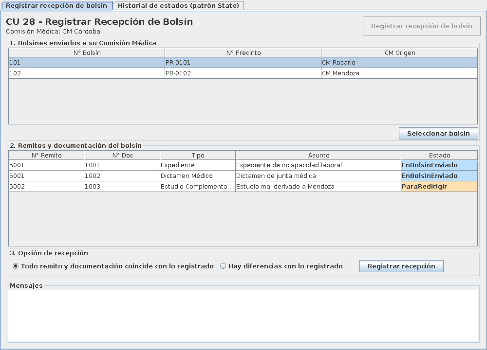
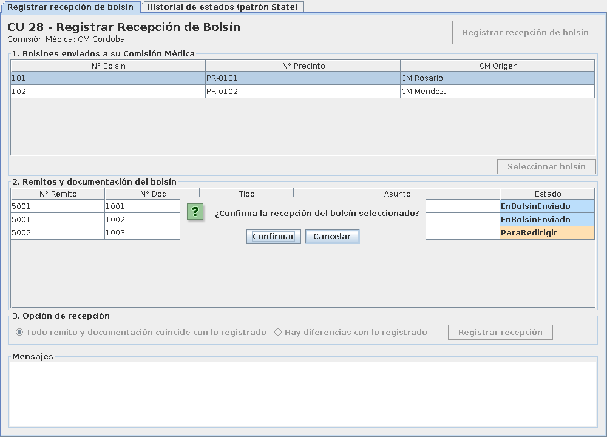
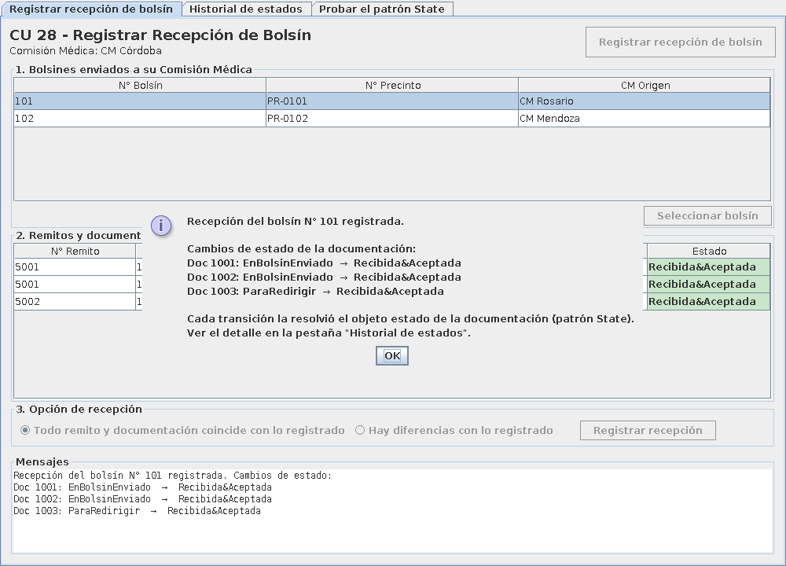
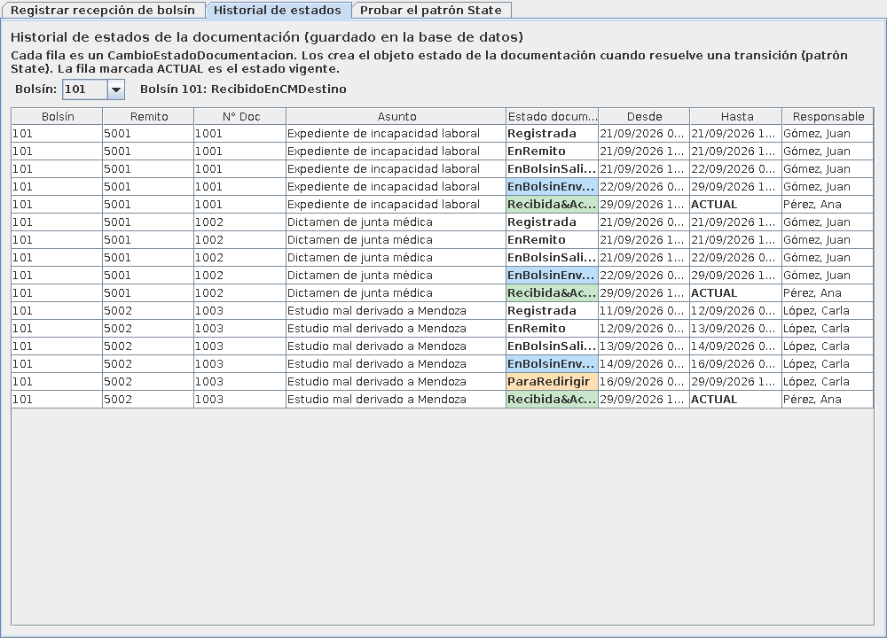
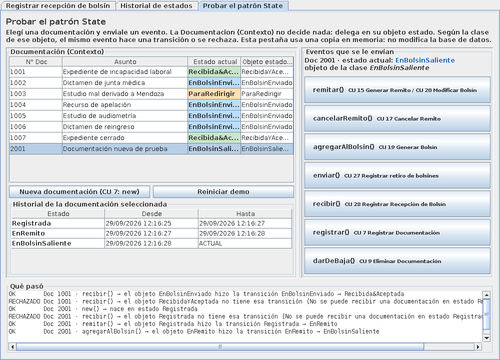
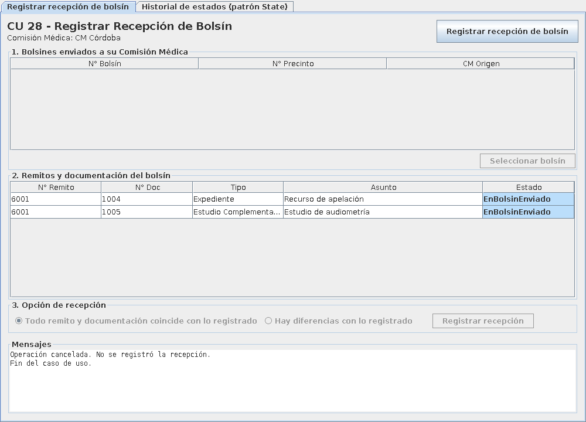
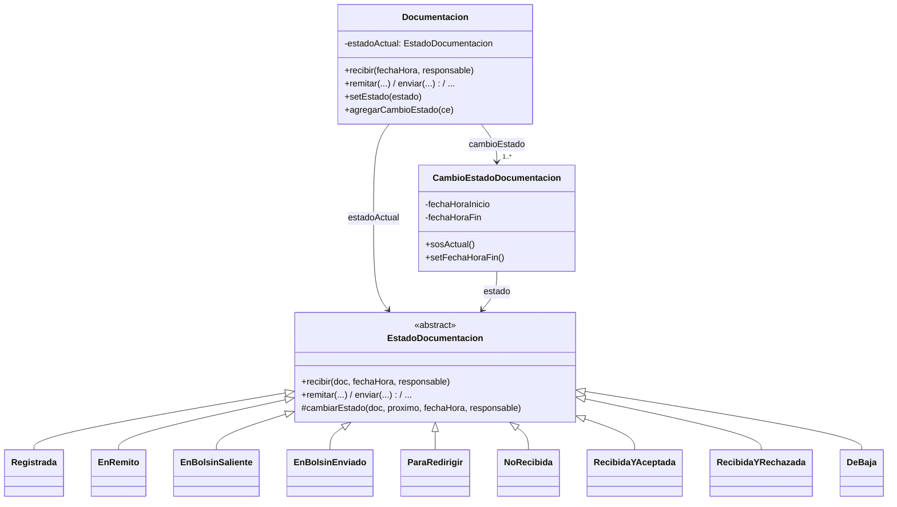

# PPAI 2026 – 3K2 – Grupo 10 – Entrega 2: CU 28 "Registrar Recepción de Bolsín"

Rediseño e implementación de la realización del caso de uso de análisis
`PPAI2026_3K2_G10_E1_Analisis`, aplicando el **patrón de diseño State (Gamma)** a la clase
`Documentacion`, bajo el **Paradigma Orientado a Objetos**.

> ### ▶ ¿Querés ejecutarlo? Seguí la guía paso a paso: **[COMO_EJECUTAR.md](COMO_EJECUTAR.md)**
> Resumen: instalar Java 17+, descargar el proyecto y hacer doble clic en **`ejecutar.bat`**.
> La guía incluye un guion para probar el flujo principal y los alternativos, y una tabla de
> problemas frecuentes.

## 1. Detalles de implementación

| Ítem | Elección |
|------|----------|
| a. Lenguaje | **Java 17** |
| b. Framework de programación | **Maven** (build y dependencias) · **JUnit 5** (pruebas). La interfaz gráfica usa **Swing** (incluido en Java). |
| c. Tecnología | **Escritorio** (aplicación Swing). También se puede ejecutar por consola. |
| d. Base de datos y persistencia | **SQLite** (archivo `bolsines.db`, no requiere instalar nada) con **JPA (Jakarta Persistence) implementado por Hibernate 6** como framework de persistencia |

## 2. Cómo ejecutarlo

Ver **[COMO_EJECUTAR.md](COMO_EJECUTAR.md)** (instalación de Java, descarga, ejecución,
guion de prueba y problemas frecuentes). Resumen para quien ya tiene Java 17+:

| Sistema | Ejecutar | Volver a los datos de prueba |
|---------|----------|------------------------------|
| Windows | doble clic en `ejecutar.bat` | doble clic en `ejecutar-desde-cero.bat` |
| Mac / Linux | `./ejecutar.sh` | `./ejecutar.sh --reiniciar-datos` |
| Manual | `.\mvnw.cmd package` y `java -jar target\ppai-bolsines-g10-1.0.0.jar` | agregar `--reiniciar-datos` |

No hace falta instalar Maven (el proyecto trae el Maven Wrapper) ni una base de datos
(SQLite es el archivo `bolsines.db`, que se crea solo). **Los cambios quedan guardados**
entre ejecuciones.

Datos de prueba: el usuario logueado es `aperez` (CM Córdoba). Hay dos bolsines enviados a
CM Córdoba (101 y 102), uno enviado a otra CM (103) y uno ya recibido (104); estos dos
últimos **no** deben aparecer en la lista. El bolsín 101 trae una documentación en estado
`ParaRedirigir`, que también se recibe (otro estado concreto, la misma operación `recibir()`).

## 3. Flujos del caso de uso implementados

**Flujo principal:** el empleado elige "Registrar recepción de bolsín". El sistema muestra
la CM del usuario y los bolsines enviados a ella (N° bolsín, precinto, CM origen). El
empleado selecciona un bolsín y el sistema muestra sus remitos y documentación. El empleado
elige la opción "todo coincide con lo registrado" y confirma. El sistema:

1. registra el bolsín como RecibidoEnCMDestino;
2. registra los remitos como RecibidoYAceptado;
3. pasa la documentación a Recibida&Aceptada (patrón State);
4. guarda todo en la base en una transacción;
5. notifica por mail (CU 29, simulado) y finaliza.

**Flujos alternativos:**

| # | Situación | Qué hace el sistema |
|---|-----------|---------------------|
| A1 | No hay bolsines enviados pendientes para la CM del usuario | Informa que no hay bolsines y finaliza el CU (se ve después de recibir el 101 y el 102) |
| A2 | El empleado no confirma la recepción | Informa que se canceló; no cambia ningún estado ni se guarda nada |
| A3 | El empleado indica que hay diferencias con lo registrado | Informa que corresponde el CU 31 Registrar Revisión de Documentación y finaliza |
| A4 | Falla al registrar (por ejemplo, un evento inválido para el estado de una documentación) | Deshace la transacción (rollback), informa el error y no se guarda ningún cambio |

## 4. Capturas

La ventana tiene tres pestañas:

1. **Registrar recepción de bolsín**: el caso de uso.
2. **Historial de estados**: los `CambioEstadoDocumentacion` guardados en la base, filtrables por bolsín.
3. **Probar el patrón State**: herramienta para la defensa. Le aplica cualquier evento a cualquier documentación, sobre una copia en memoria que no toca la base.

| Selección de bolsín y documentación | Confirmación |
|---|---|
|  |  |
| **Cambios de estado al registrar la recepción** | **Historial de estados del bolsín 101** |
|  |  |
| **Probar el patrón State** | **Flujo alternativo A2: cancelación** |
|  |  |

## 5. Arquitectura (capas)

| Capa | Paquete | Clases |
|------|---------|--------|
| Herramientas de la defensa (fuera del CU) | `ppai` | `VisorHistorialEstados`, `DemostracionPatronState` |
| Interfaz (boundary) | `ppai.boundary` | `PantallaRecepcionBolsin` (interfaz), `PantallaGraficaRecepcionBolsin` (Swing), `PantallaConsolaRecepcionBolsin` |
| Control | `ppai.control` | `GestorRecepcionBolsin`, `GestorNotificacionCU29` |
| Dominio (entity) | `ppai.entidades` | `Bolsin`, `Remito`, `DetalleRemito`, `Documentacion`, `CambioEstadoBolsin`, `CambioEstadoDocumentacion`, `Estado`, `Empleado`, `Sesion`, `ComisionMedica`, `TipoDocumento` |
| Patrón State | `ppai.entidades.estadodocumentacion` | `EstadoDocumentacion` + 9 estados concretos |
| Persistencia | `ppai.persistencia` | `Repositorio` (esquema de persistencia), `RepositorioJPA` (SQLite + Hibernate), `ConversorEstadoDocumentacion`, `DatosDePrueba`, `RepositorioEnMemoria` (sólo pruebas) |
| Configuración JPA | `src/main/resources/META-INF` | `persistence.xml` |

Los nombres de clases y métodos respetan el diagrama de clases y el de secuencia del
análisis (`registrarNuevoRecBolsin`, `buscarCMUsuarioLogged`, `buscarBolsinesEnviadosCM`,
`buscarCMOrigenBolsines`, `tomarSeleccionBolsin`, `buscarInformacionRemito`,
`tomarSeleccionPrimerOpcion`, `tomarConfirmacion`, `getFechaYHoraActual`,
`buscarEstadoRecibidoEnCMDestino`, `recibirBolsin`, `recibirYAceptarRemito`,
`recibirYAceptar`, `actualizarEstadoDoc`, `recibir`, `buscarInformacionDocumentacion`,
`buscarCorreoCM`, `llamarCU29`, `finCU`, etc.).

El gestor accede a los objetos persistentes sólo a través de la interfaz `Repositorio`
(esquema de persistencia). Por eso el mismo gestor funciona con la base SQLite
(`RepositorioJPA`) y con datos en memoria (`RepositorioEnMemoria`, que usan las pruebas).

## 6. Persistencia (SQLite + JPA/Hibernate)

- **Mapeo:** cada entidad tiene anotaciones JPA (`@Entity`, `@Id`, `@ManyToOne`,
  `@OneToMany`). Hibernate crea las tablas (`bolsin`, `remito`, `detalle_remito`,
  `documentacion`, `cambio_estado_documentacion`, `cambio_estado_bolsin`, `estado`,
  `empleado`, `comision_medica`, `tipo_documento`, `sesion`).
- **Identidad de objeto:** cada entidad tiene un `id` autogenerado (clave primaria).
- **Materialización y desmaterialización:** las hace Hibernate. Al guardar el bolsín, en
  cascada se guardan sus remitos, detalles, documentación y cambios de estado.
- **Estados del patrón State:** los estados concretos no tienen atributos, así que no
  tienen tabla propia. `ConversorEstadoDocumentacion` guarda en la columna `estado` de
  `cambio_estado_documentacion` el nombre del estado y, al leer, crea el objeto del estado
  concreto. El `estadoActual` de `Documentacion` no se guarda como columna: se reconstruye
  desde el cambio de estado vigente con `@PostLoad`, para que nunca pueda quedar
  inconsistente con el historial.
- **Transacciones:** la recepción se registra entre `iniciarTransaccion()` y
  `confirmarTransaccion()` (commit). Si algo falla, `deshacerTransaccion()` hace rollback.
- **Materialización perezosa:** las colecciones (`@OneToMany`) se cargan bajo demanda.

## 7. Patrón State

Participantes (según la plantilla de la cátedra):

- **Contexto: `Documentacion`.** Conoce su `estadoActual` y **delega** cada evento de su
  máquina de estados (`remitar`, `cancelarRemito`, `agregarAlBolsin`, `enviar`, `recibir`,
  `registrar`, `darDeBaja`).
- **Estado abstracto: `EstadoDocumentacion`.** Declara un método por evento. Por defecto
  lanza `IllegalStateException` (transición inválida). Además tiene los pasos comunes de
  toda transición: cerrar el `CambioEstadoDocumentacion` actual, crear el nuevo y hacer
  `setEstado` en el contexto.
- **Estados concretos:** `Registrada`, `EnRemito`, `EnBolsinSaliente`, `EnBolsinEnviado`,
  `ParaRedirigir`, `NoRecibida`, `RecibidaYAceptada`, `RecibidaYRechazada`, `DeBaja`.
  Cada uno redefine sólo las transiciones que salen de él en la máquina de estados.



### Dinámica en el CU 28

```
GestorRecepcionBolsin.tomarConfirmacion()
 └─ Bolsin.recibirYAceptarRemito()
     └─ Remito.recibirYAceptar()
         └─ DetalleRemito.actualizarEstadoDoc()
             └─ Documentacion.recibir()
                 └─ estadoActual.recibir(this, ...)      ← polimorfismo
                     EnBolsinEnviado.recibir(): cierra CE actual, new RecibidaYAceptada(),
                                                new CambioEstadoDocumentacion, doc.setEstado()
                     ParaRedirigir.recibir():   ídem → RecibidaYAceptada
```

### Cambios respecto del análisis

- Se eliminó `buscarEstadoRecibidaYAceptada()` del gestor y el loop sobre `Estado`
  preguntando `esAmbitoDocumentacion()` / `esRecibidaYAceptada()`: ahora el estado siguiente
  lo decide el estado concreto de cada documentación.
- `Estado` ya no tiene ámbito Documentación. `CambioEstadoDocumentacion` referencia a un
  `EstadoDocumentacion`.
- Una documentación en `ParaRedirigir` también se recibe correctamente, sin agregar
  ningún `if` (las dos transiciones del CU 28 de la máquina de estados).
- Un evento inválido para el estado actual, por ejemplo recibir una documentación
  `Registrada`, se rechaza con una excepción en lugar de dejar un estado inconsistente.

### Cómo mostrar el patrón en la defensa

**¿Dónde interviene State?** No en el historial, que es sólo el resultado. Interviene en la
lógica: el gestor le dice a cada documentación `recibir()` sin preguntar en qué estado está,
y la documentación delega en su objeto estado. La clase de ese objeto decide si hay
transición y cuál es el estado siguiente.

1. **Pestaña "Registrar recepción de bolsín"**, bolsín 101. Trae documentación en dos
   estados distintos (`EnBolsinEnviado` y `ParaRedirigir`). El mismo `recibir()` lo resuelven
   dos clases distintas, y el diálogo final muestra cada transición.
2. **Código:** `Documentacion.recibir()` sólo hace `estadoActual.recibir(this, ...)`.
   `EnBolsinEnviado.recibir()` y `ParaRedirigir.recibir()` hacen la transición. `Registrada`
   no redefine `recibir()`, así que hereda el rechazo de `EstadoDocumentacion`.
3. **Pestaña "Probar el patrón State"**: elegir una documentación y apretar el mismo botón
   en distintos estados. Por ejemplo, `recibir()` sobre la 1001 pasa a Recibida&Aceptada; si
   se aprieta otra vez, `RecibidaYAceptada` lo rechaza. Con "Nueva documentación" se crea
   una en `Registrada` y se puede recorrer toda la máquina de estados: `remitar()` →
   `agregarAlBolsin()` → `enviar()` → `recibir()`.
4. **Pestaña "Historial de estados"**: muestra los `CambioEstadoDocumentacion` que crearon los
   estados concretos, tal como quedaron en la base.

## 8. Diseño de la interfaz de usuario

Patrones y criterios de diseño de GUI aplicados en `PantallaGraficaRecepcionBolsin`:

- **Asistente por pasos:** secciones numeradas 1 → 2 → 3 que siguen el orden del caso de
  uso; sólo está habilitado el control del paso actual (**prevención de errores**).
- **Confirmación antes de una acción que modifica datos:** diálogo "Confirmar / Cancelar".
- **Retroalimentación inmediata:** el área de Mensajes informa el resultado, los errores y
  el mail enviado (CU 29). La columna Estado se actualiza al registrar la recepción.
- **Codificación por color de estados:** EnBolsinEnviado (celeste), ParaRedirigir
  (naranja), Recibida&Aceptada (verde).
- **Visibilidad del contexto:** siempre se ve la CM del usuario logueado.

El diseño de experiencia de usuario (mapas de empatía, journey, modo board) lo aporta el
grupo a partir de las actividades de descubrimiento hechas en el aula.

## 9. Pruebas

`mvn test` ejecuta 13 pruebas:

- `EstadoDocumentacionTest`: la máquina de estados completa, incluidas las transiciones
  inválidas.
- `RegistrarRecepcionBolsinTest`: el flujo principal y los alternativos, en memoria.
- `RepositorioJPATest`: guarda en SQLite, vuelve a abrir la base y verifica los estados;
  también verifica que al cancelar no se guarda nada.

## 10. Alcance

- `Bolsin` y `Remito` mantienen la entidad `Estado` con ámbito, tal como en el análisis,
  porque la entrega sólo modela la máquina de estados de Documentación. Si se modelan sus
  máquinas de estados, se les puede aplicar State de la misma forma.
- Las transiciones del CU 31 (Registrar Revisión de Documentación) no se implementan. La
  opción "Hay diferencias con lo registrado" informa que corresponde el CU 31.
- El CU 29 (notificación por correo) se simula mostrando el mail en el área de Mensajes o en la consola.
